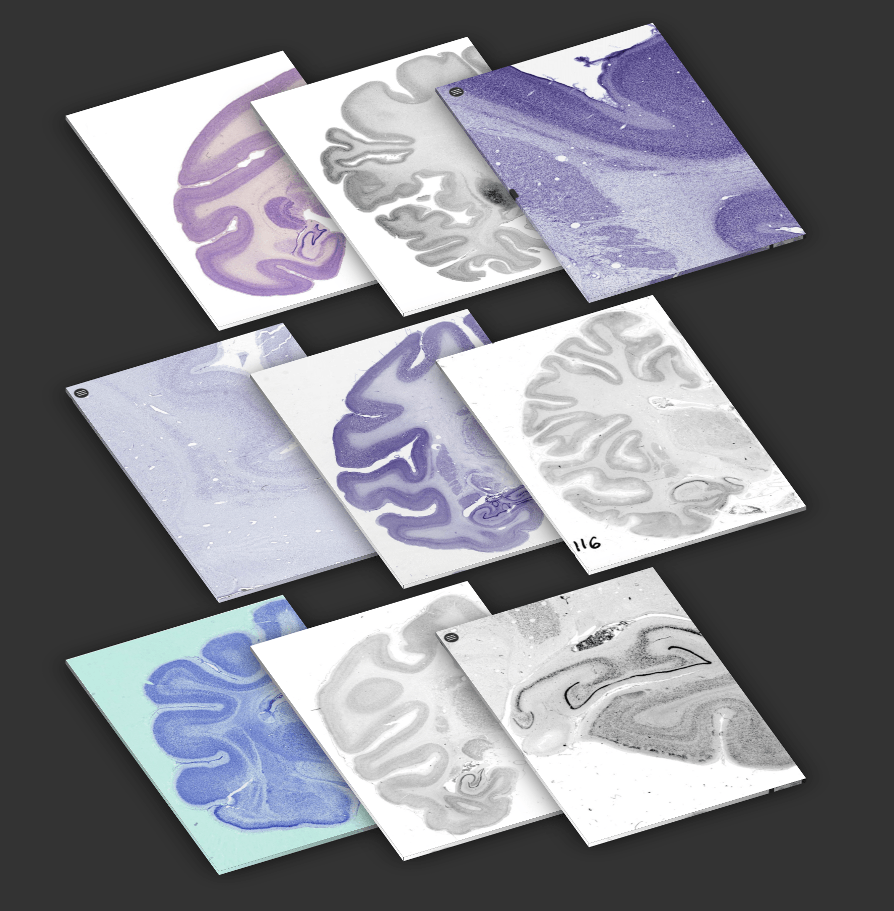

# histology-db
Building an online database for storing, curating and sharing metadata and data from diverse collections of histological data.  

## Project description

#### Problem
Brain histology provides unique information on the cellular structure of the brain. Histological data has been collected for more than a century, and is available for a wide variety of species and developmental stages. The physical slides require lots of effort for being digitised at high resolution, and thus, usually only selected slides, representing only specific regions and specimens within much larger collections have been scanned by individual researchers for their own projects. This has led to a wealth of digitised histological data being spread across several researchers and labs, with no coherent structure, common identifiers, or a method to see, access, and annotate the data.

Histological data is challenging to visualise, analyse and share, and often requires time intense manual curation and annotation. With the lack of a shared database, researchers find themselves redoing manual annotations redundantly, instead of being able to build an increasingly detailed picture of the brain microstructure together.

#### Vision
We would like to build an online database for storing, curating, sharing, accessing, and annotating metadata from several brain histology datasets, alongside with the real digitised data (images and text) whenever it is available. In a joint effort with anatomists worldwide we will build a searchable database for the primates of the Stephan and Zilles Collections, which are among the most important histological data collections for comparative neuroanatomy. It represents the world’s largest collection of whole brain histological slides from diverse primate species, as well as other animals. We would like to make this data available to the scientific community in a structured way in order to reduce redundant efforts, allow scientists to tackle analyses and challenges collaboratively in a coordinated fashion.

#### Aim
We have access to records from different histological collections. The aim of the project will be to organise the data, develop a database, a RESTful API to query the data programmatically, and a Web interface to allow researchers to browse and query the database. Whenever digitised histological data becomes available, it will be made available with a link to our tool MicroDraw to visualise it and segment it collaboratively.
